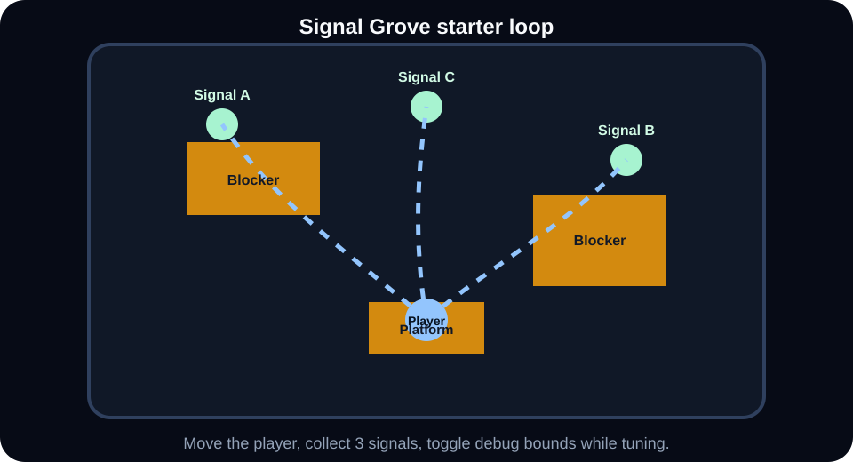
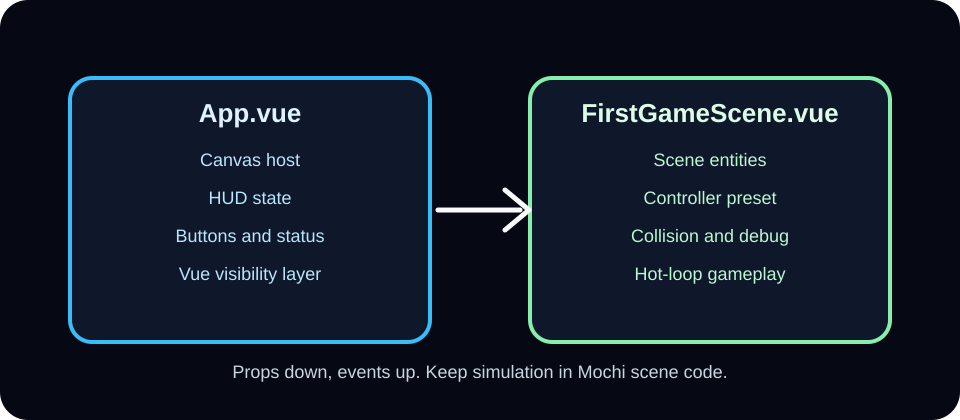
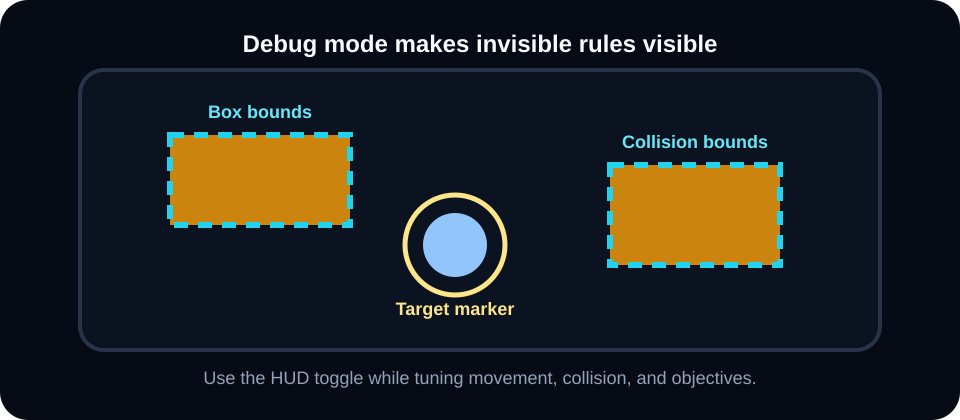

# First Game in 10 Minutes

This guide uses the alpha starter app as the external developer path. It avoids engine internals and playground-only shortcuts.



## What you will build

`Signal Grove` is a tiny third-person collection loop:

- move a player with a controller preset
- collect three glowing signals
- collide with blockers and stand on a platform
- toggle debug visuals while tuning the scene
- build the app for production

Use the checkboxes as you go. If a step feels unclear, that is alpha feedback worth filing.

## 1) Run the starter

```bash
pnpm install
pnpm dev:starter
```

Open the URL printed by Vite. You should see `Signal Grove`, a small third-person collection scene.

- [ ] The app opens.
- [ ] The HUD shows `Signals: 0 / 3`.
- [ ] WASD moves the player.
- [ ] The debug button toggles bounds and target markers.

<details>
<summary>Troubleshooting</summary>

- If dependencies are missing, run `pnpm install`.
- If the port is busy, use the alternate Vite URL printed by the terminal.
- If the canvas is blank, check the browser console for WebGL2 support errors.

</details>

## 2) Understand the component split

The starter has two important files:

- `apps/alpha-starter/src/App.vue` hosts `<GameCanvas>` and HUD state.
- `apps/alpha-starter/src/game/FirstGameScene.vue` owns scene entities, controller setup, collision, and gameplay rules.

This is the recommended split for Vue games: Vue renders HUD and menus, while the scene component owns simulation setup.



Try this:

- [ ] Open `apps/alpha-starter/src/App.vue`.
- [ ] Change the title text from `Signal Grove` to another name.
- [ ] Open `apps/alpha-starter/src/game/FirstGameScene.vue`.
- [ ] Find where the player entity is created.

## 3) Mount the game canvas

```vue
<GameCanvas :runtime="{ fixedStep: 1 / 60 }">
  <FirstGameScene />
</GameCanvas>
```

Use `fixedStep` for gameplay loops that should behave consistently across frame rates.

Interactive tweak:

```vue
<GameCanvas
  :runtime="{ fixedStep: 1 / 60, maxDelta: 0.1, maxFixedSteps: 5 }"
  :clear-color="[0.03, 0.035, 0.06, 1]"
>
  <FirstGameScene />
</GameCanvas>
```

- [ ] Change the clear color.
- [ ] Reload the starter.
- [ ] Confirm only the background changed, not the game rules.

## 4) Create an entity

```ts
const player = scene.createEntity({
  id: 'player',
  tags: ['player'],
  transform: {
    position: { x: 0, y: 0.65, z: 4 },
    scale: { x: 0.8, y: 1.3, z: 0.8 },
  },
  renderable: {
    primitive: 'cube',
    material: createMaterial('solid'),
  },
});
```

Prefer stable IDs and tags early. They make debugging, inspection, saves, and future editor workflows easier.

Interactive tweak:

- [ ] Change the player scale to `{ x: 1.1, y: 1.6, z: 1.1 }`.
- [ ] Reload and confirm the player is larger.
- [ ] Change the material from `solid` to `emissive`.

## 5) Add controls

```ts
scene.add(
  createThirdPersonOverShoulderController(game, {
    target: player,
  }),
);
```

Scene ownership keeps cleanup simple. When the scene unmounts, the controller and frame listeners are disposed with it.

Interactive tweak:

- [ ] Change the controller to `createThirdPersonOrbitController`.
- [ ] Add it to the import from `@mochi-labs/gameplay`.
- [ ] Compare how camera movement feels.
- [ ] Switch back if you prefer the starter default.

## 6) Add collision and debug visuals

```ts
const blocker = createBoxCollider(wallEntity);

createDebugBoxBounds(scene, [blocker], {
  enabled: () => showDebug,
});

scene.onFrame(() => {
  resolveBoxCollisions(player, [blocker]);
});
```

Use debug helpers while building. Turn them off for final gameplay, but keep the toggle around while tuning movement.



Interactive tweak:

- [ ] Toggle debug on.
- [ ] Change one blocker scale.
- [ ] Confirm the debug bounds update with it.
- [ ] Try increasing the player collision radius in `resolveBoxCollisions`.

<details>
<summary>Why debug visuals matter</summary>

Game feel improves faster when invisible rules become visible. Debug bounds show collision sizes, target markers show controller focus, and future debug tools should make selection, rays, triggers, and sensors inspectable the same way.

</details>

## 7) Build it

```bash
pnpm --filter alpha-starter build
```

The root verification command also builds the starter:

```bash
pnpm verify
```

Final checklist:

- [ ] `pnpm --filter alpha-starter build` passes.
- [ ] `pnpm verify` passes.
- [ ] You changed one visual value and saw it in the app.
- [ ] You changed one gameplay value and understood the effect.

## Where to go next

- Add a second scene component.
- Move repeated entity creation into `src/game/entities`.
- Move repeated frame rules into `src/game/systems`.
- Keep code in the app until it is clearly reusable across projects.
